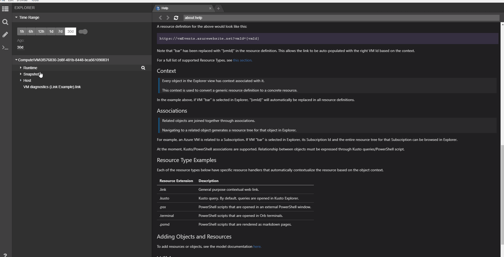
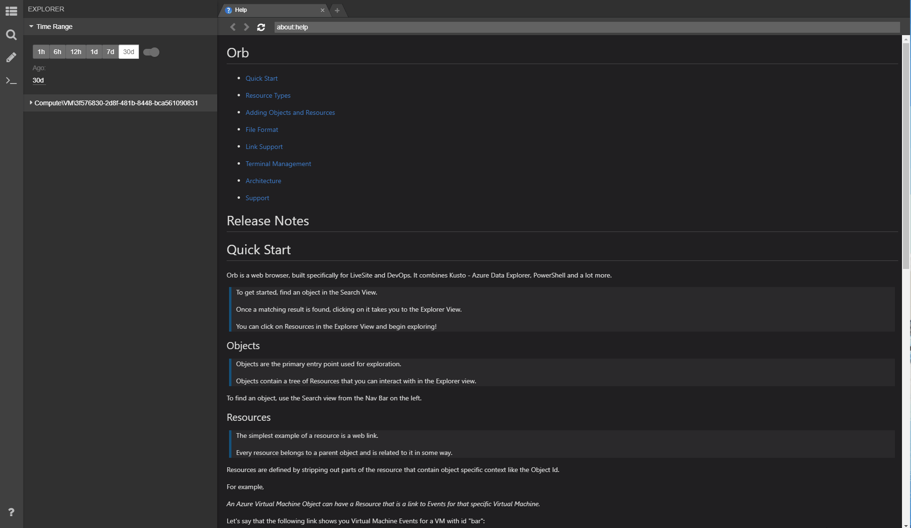

Orb is a tool built specifically for running Live Site for your services. Orb is used by engineers in Azure to manage internal Azure services.

# Installation
Download the latest installer from the [releases page.](https://github.com/microsoft/Orb/releases)

To setup Orb for your organization, take a look at the [Onboarding guide](./dist/resources/app/documentation/onboarding.md)

# Features
## Object and Context Driven
Orb allows you to rapidly browse through information based on an object hierarchy. 

When any resource on the object tree is clicked, all context associated with that object is passed to the resource link.
Since all variables for an object are automatically injected for you, this allows you to rapidly explore shared queries, dashboards, links, scripts and more.

## Backed by Azure Data Explorer
Object heirarchies are user defined and backed by ADX queries. ADX integration allows rapidly searching for objects and discovering hierarchies dynamically.

## Extensible and Shareable
All object definitions and hierarchies are defined as JSON config. You can edit object definitions, add resources and share your changes from within Orb.

These config files are stored on a Git repository - this provides a shared view of Live Site resources across the entire organization.

## PowerShell Support
Orb allows you to save and share PowerShell snippets. The results of these PowerShell snippets are displayed as web pages rendered using Markdown. These snippets could be common mitigation actions, data collection triggers and more.

Since Orb allows multiple tabs, you can open up saved snippets and run them in parallel. Since the script result is a web page, you can Ctrl + F to search through the output.

## Terminal Integration
In addition to PowerShell Markdown support, you can open a fully functional PowerShell terminal in Orb.
You can define custom terminal profiles to launch terminals with custom startup scripts. These startup scripts can also be shared through the git repository, allowing teams to use consistent startup scripts.

## Orb Files and Links
You can save Orb state to a file, edit it, pin it to your JumpList to accelerate repeated workflows.

You can also share your Orb state as a link.

## Built On Electron
Orb is built on [Electron](https://electronjs.org/).

Every tab in Orb is a Chromium process.

## OS Support
Orb is currently only supported on Windows machines. Since electron is cross-platform, Linux/MacOs support is possible through future updates.

## [Contributing](CONTRIBUTING.md)

